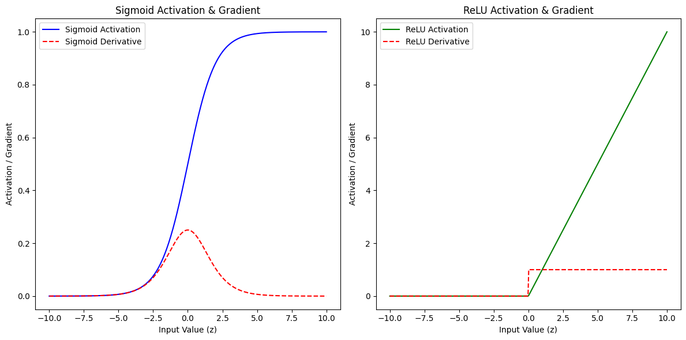

# Neural Network — Activation Functions & Vanishing Gradient


This project demonstrates how different activation functions affect learning, with a focus on the **vanishing gradient problem**.

It compares sigmoid and ReLU activations and visualizes their gradients.

---

## Overview

In deep neural networks, gradients can become extremely small during backpropagation, slowing or stopping learning.  
This is known as the **vanishing gradient problem**.

This notebook explores:

- Sigmoid activation behavior  
- ReLU activation behavior  
- Gradient flow through each  

---

## Activation Functions

### Sigmoid
```
σ(x) = 1 / (1 + e^{-x})
```

- Output range: (0, 1)  
- Saturates at large |x|  
- Gradients approach 0 in extreme regions  

---

### ReLU (Rectified Linear Unit)
```
ReLU(x) = max(0, x)
```

- Output: 0 for x < 0, linear for x > 0  
- Does not saturate for positive values  
- Preserves stronger gradients  

---

## Gradient Behavior

Gradients determine how much weights update during training.

### Sigmoid Gradient
```
σ'(x) = σ(x)(1 - σ(x))
```

- Maximum at center  
- Very small at extremes  
- Leads to vanishing gradients  

---

### ReLU Gradient
```
ReLU'(x) = 1 if x > 0 else 0
```

- Constant gradient for positive inputs  
- Avoids vanishing gradient in active region  

---

## Visualization

The notebook visualizes both activations and their gradients:



### Observations

- Sigmoid:
  - Smooth curve
  - Gradients shrink near extremes  
- ReLU:
  - Sharp transition at 0  
  - Maintains strong gradients for positive inputs  

---

## Key Insight

- Sigmoid causes **slow learning in deep networks** due to shrinking gradients  
- ReLU enables **faster and more stable training**

---

## Code Structure

- Compute activation values over a range  
- Compute corresponding gradients  
- Plot functions and gradients  
- Compare behaviors visually  

---

## Running the Notebook

1. Clone repository
```
git clone https://github.com/yourusername/your-repository.git
```

2. Install dependencies
```
pip install numpy matplotlib
```

3. Launch notebook
```
jupyter notebook
```

---

## Summary

This project highlights:

- Why activation choice matters  
- How gradients behave in different functions  
- The root cause of the vanishing gradient problem  

A concise visual explanation of a key challenge in deep learning.
